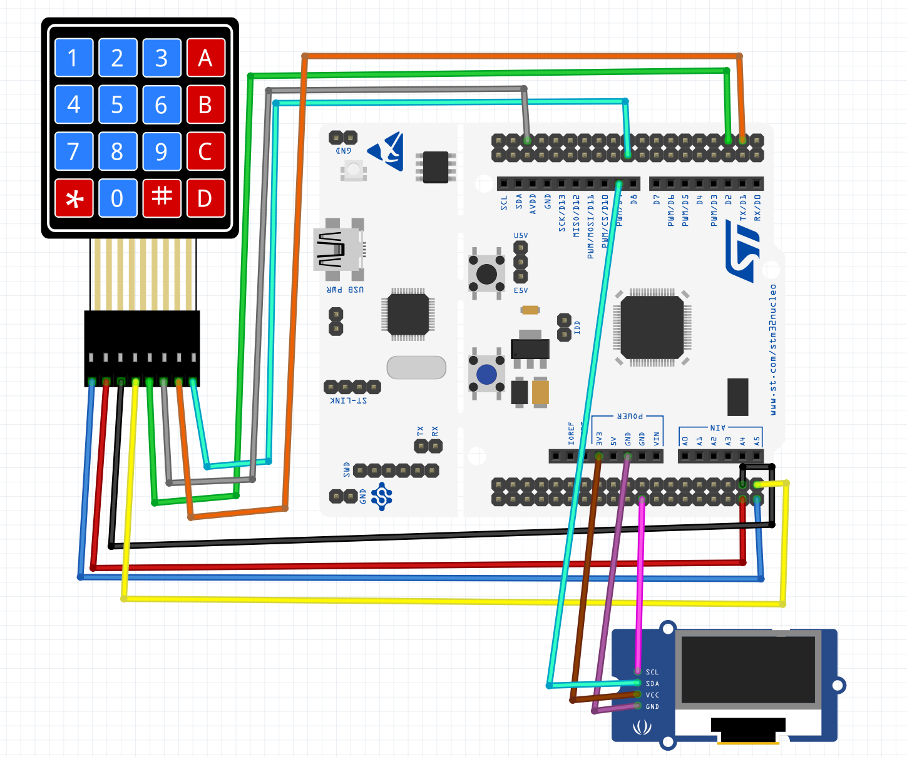

# Chip8 Emulator on a STM32 Board

This project is a chip8 emulator implemented on a STM32 microcontroller.
It includes all the peripherals needed to play Chip-8 games.

### Hardware:
- STM32F4 Microcontroller
- 4x4 Membrane Matrix Keypad
- SSD1306 OLED display

Add your games to the `roms.h` header file. You can convert your games from binary format to a C++ array using the xxd command: `xxd -i game.ch8`

### How to run it
- Download the STM32CubeIDE and open this project in the IDE
- In the constructor of the Chip8 class (`Emulator/Chip8`), replace the rom array with the rom of your choice from the `roms.h` file
- Connect the board to the computer and run it as a STM32 C/C++ application to flash it and you can play the game

### Diagram of the setup
